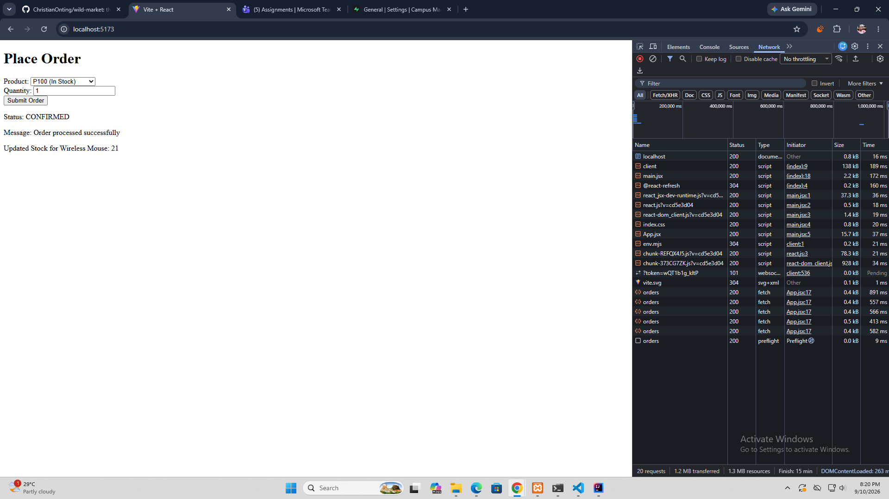
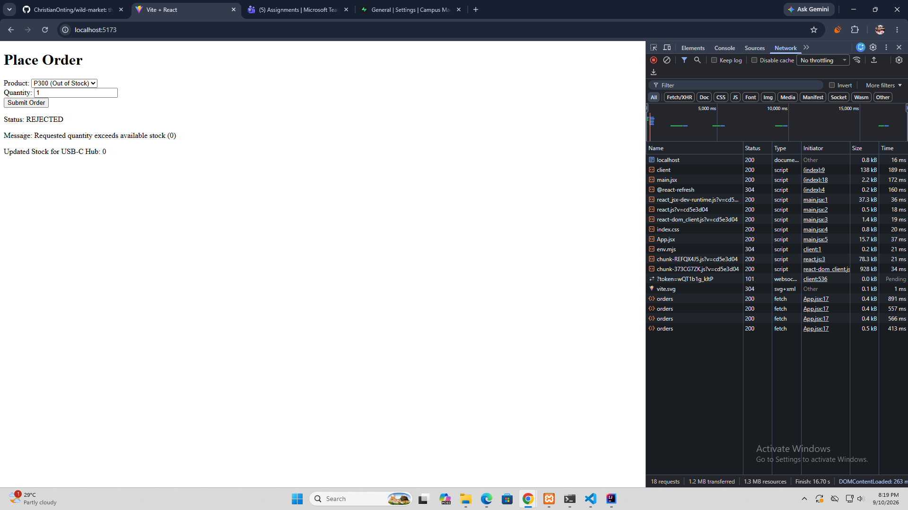
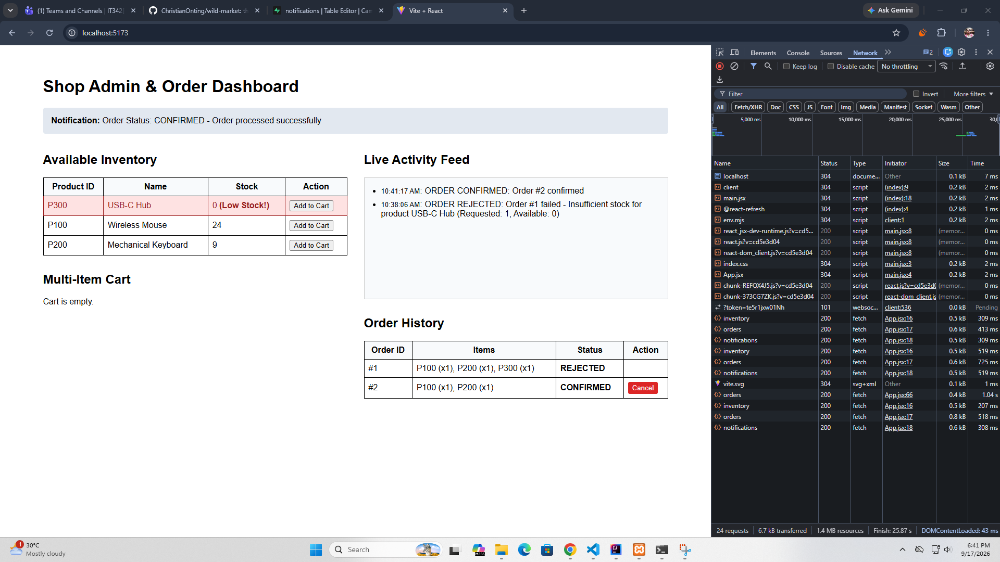
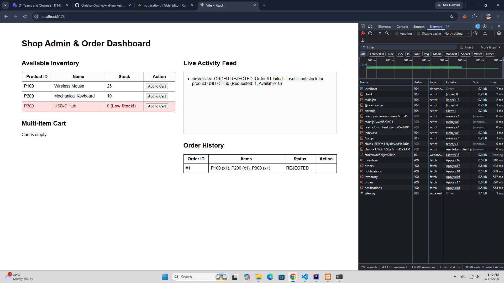

# Three-Tier Shop Application (Spring Boot + React + Supabase)

## Lab 1: Supabase Database Setup
1. Created a PostgreSQL database on Supabase.
2. Executed the `schema.sql` script in the Supabase SQL Editor to initialize `inventory` and `orders` tables and seed default products (`P100`, `P200`, `P300`).
3. Retained the IPv4 Session Pooler host (`aws-0-ap-northeast-2.pooler.supabase.com`) for Spring Boot connection pooling.
4. Set the database password locally using the `DB_PASSWORD` environment variable to ensure credentials are never committed to Git.

## Network Tab Evidence
### Confirmed Order Path (P100)

### Rejected Order Path (P300)

---

## Architectural Reflection

### 1. In-Process Integration vs. Separate Microservices
Integrating OrderService and InventoryService in-process within a single Spring Boot application provides low latency, direct Java method calls, compile-time type safety, and transactional consistency out of the box using @Transactional. Transactions execute atomically across both order writing and stock updates within the same database connection. 

If split into separate microservices over HTTP/gRPC, we lose ACID transactions, necessitating distributed transaction patterns like Sagas or Two-Phase Commit (2PC) along with eventual consistency models. Furthermore, network latency, serialization overhead, API gateways, circuit breakers (e.g., Resilience4j), service discovery, and retry mechanisms would need to be added to manage remote network failures and service unreliability.

### 2. Importance of Package-Private Visibility on InventoryServiceImpl
Enforcing package-private visibility on InventoryServiceImpl guarantees strict module boundaries at compile time. The shop package is forced to depend exclusively on the InventoryService interface exposed by the inventory module.

If InventoryServiceImpl were made public, developer code in the shop module could directly instantiate or cast to the implementation class. This leaks internal operational details, bypasses interface abstraction, creates tight coupling, and invalidates the modular monolith boundary—making future refactoring or service extraction significantly harder.

### 3. Extracting Inventory into its Own Microservice
Extracting Inventory into an independent microservice would be justified when inventory management requires independent scaling (e.g., high-frequency stock reads during sales), dedicated database isolation, or autonomous deployment lifecycles by a separate engineering team.

To accomplish this:
* **Code Adjustments:** Replace direct in-process calls to InventoryService inside OrderService with an HTTP client (RestTemplate, WebClient, or FeignClient) or an asynchronous message broker (RabbitMQ/Kafka).
* **Database Adjustments:** Split the database into two isolated storage instances—one for Orders and one for Inventory.
* **Resilience Adjustments:** Introduce fallback mechanisms, timeout configurations, and circuit breakers when calling the external Inventory REST API to handle service downtime gracefully.

# Lab 2: Multi-Item Shop Monolith with Event-Driven Notifications

## Supabase Setup
1. Executed `schema.sql` in the Supabase SQL Editor to initialize `inventory`, `orders`, `order_items`, and `notifications` tables.
2. Verified initial seed data for products `P100`, `P200`, and `P300`.
3. Configured `DB_PASSWORD` via environment variables for secure database connectivity.

---

## Network Tab Evidence
### **Multi-Item Confirmed Order:** 

### **Multi-Item Rejected Order (All-or-Nothing Rollback):** 

### **Order Cancellation & Restock:** 

### **Notification Feed (Confirmed, Rejected, Low Stock):** 

---

## Architectural Reflection

### 1. Multi-Item Orders and Network Splits
In our app, wrapping OrderService.placeOrder() with @Transactional keeps everything safe. Because Order and Inventory use the exact same database, if any item in a multi-item order fails validation or runs out of stock, the database cancels and undoes all changes automatically. It is an "all-or-nothing" deal.

If we split Order and Inventory into two separate services over a network, they would no longer share a single database. We couldn't rely on automatic undoing anymore. Instead, we would have to write extra code (like the **Saga Pattern**) to manually send "undo" or "cancel reservation" requests back to the Inventory service if something fails halfway through an order.

### 2. Events vs. Direct Service Calls
Instead of having OrderService call Notification directly, OrderService just announces what happened by sending an event (OrderPlacedEvent or OrderRejectedEvent). OrderService doesn't care who receives the message, and Notification only looks at the message data. This keeps both modules completely independent so changes in one won't break the other.

If Notification became its own separate microservice on another server, simple Java events wouldn't work across the network. We would need a Message Broker (like RabbitMQ or Apache Kafka) to pass messages between servers. We would also need to make sure messages aren't lost if the network drops, and ensure the Notification service doesn't process duplicate messages by mistake.

### 3. Which Module to Split First
If I had to turn one module into its own microservice first, I would choose the Notification Module.

**Why Notification First:**
* **Low Risk:** Notifications (like logging or sending alerts) are just side effects. If the notification system slows down or breaks, it won't stop a customer from successfully placing an order.
* **Easy to Separate:** It only receives information; it doesn't need to return data back to the Order process.

**What Changes in Code:**
* Replace Spring's @EventListener with a message listener that reads from a message queue (like RabbitMQ or Kafka).
* Have OrderService and InventoryServiceImpl send messages to that external queue instead of using internal Java events.
* Move all Notification files into a completely separate project folder and repository.